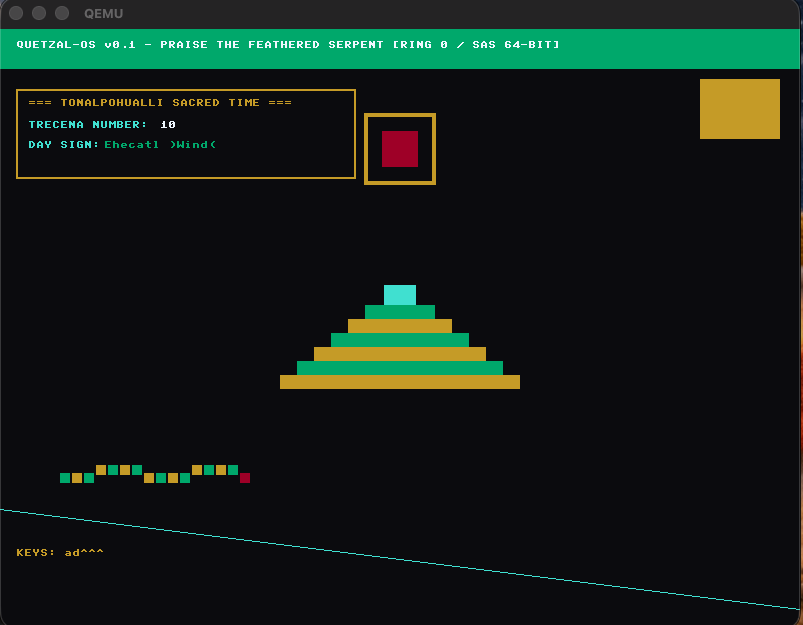

# QuetzalOS (TonalOS) 🐍📜

> *"A single-privilege-level, single-address-space 64-bit operating system operating as a digital temple dedicated to Quetzalcoatl."*

```
   =============================================================================
   QUETZAL-OS v0.1 - PRAISE THE FEATHERED SERPENT [RING 0 / SAS 64-BIT]
   =============================================================================
             /\              [TONALPOHUALLI SACRED ALMANAC]
            /  \             Trecena Number : 13
           /____\            Day Sign       : Coatl (Serpent)
          /______\           Total Ticks    : 000000000428
         /________\          
   =============================================================================
```

---



## 🏛️ Core Philosophy & Architectural Highlights

QuetzalOS (TonalOS) is a bare-metal 64-bit operating system inspired by retro workstation environments (TempleOS, NeXTSTEP, SGI IRIX) and ancient Mesoamerican ritual cosmology.

1. **Ring 0 / CPL=0 Exclusive Execution:**
   - The entire operating system, kernel modules, drivers, and SerpentC runtime execute exclusively in privilege level Ring 0.
   - Zero privilege-level context switching overhead (`syscall`/`sysret` or `int 0x80` traps eliminated).

2. **Single Address Space (SAS):**
   - Flat identity mapping: $\text{Virtual Address} == \text{Physical Address}$ across the 4 GB address space (`0x0000000000000000` to `0x00000000FFFFFFFF`).
   - No virtual memory isolation or page table swapping (`CR3` reloads) between tasks.
   - Shared unified heap with lightweight cooperative multitasking.

3. **Mesoamerican Ritual Timekeeping (*Chronos Subsystem*):**
   - Hardware interrupt clock (8254 PIT @ 100 Hz) drives a dual calendar engine based on the *Tonalpohualli* (260-day ritual almanac: 13 Trecenas $\times$ 20 Day Signs) and *Xiuhpohualli* (365-day solar calendar).

4. **Direct VBE Linear Framebuffer & Procedural Vector Engine:**
   - High-resolution 800x600 @ 32-bit RGB direct VESA linear framebuffer with PCI BAR probing and Bochs/QEMU DISPI hardware programming.
   - Double-buffering architecture for zero-flicker 60 FPS rendering.
   - Custom palette: **Obsidian** (`#0B0B0E`), **Jade** (`#00A86B`), **Aztec Gold** (`#C59B27`), **Turquoise** (`#40E0D0`), and **Cochineal Red** (`#9E0027`).
   - Custom 8x8 retro bitmap font engine + procedural vector geometry renderer (step pyramids, solar disks, animated feathered serpents).

5. **SerpentC Language Runtime:**
   - Embedded kernel-space language engine supporting direct raw memory pointers (`ptr`), raw port I/O (`inb`/`outb`), inline assembly (`asm`), and ritual graphics built-ins (`feather_draw_line`, `feather_rect`, `tonal_now`).

---

## 📁 Repository File Structure

```
QuetzalOS/
├── .github/
│   └── workflows/
│       └── build.yml         # GitHub Actions CI build workflow
├── boot/
│   └── boot.asm              # Multiboot1 entry, 32->64 bit transition, 4GB identity paging
├── docs/
│   ├── ARCHITECTURE.md       # Comprehensive OS architectural specification & memory map
│   ├── IMPROVEMENTS.md       # Phased roadmap & completion tracking table
│   ├── PHASE_1_PLAN.md       # High-priority correctness plan
│   ├── PHASE_2_PLAN.md       # SerpentC interpreter plan
│   ├── PHASE_3_PLAN.md       # Physical allocator & diagnostics plan
│   └── PHASE_4_PLAN.md       # Optimization & CI plan
├── kernel/
│   ├── arch/
│   │   └── x86_64/
│   │       ├── idt.h / idt.c # 64-bit IDT setup & 8259 PIC remapping
      ├── isr.asm       # Low-level interrupt service routine wrappers
│   │       ├── io.h          # Inline x86_64 port I/O functions (inb, outb, inw, outw, inl, outl)
│   │       ├── segments.h    # Symbolic GDT selector & IDT attribute constants
│   │       └── serial.h / .c # 16550 UART COM1 serial logger & kprintf
│   ├── drivers/
│   │   ├── vbe.h / vbe.c     # VESA linear framebuffer driver, 256-bus PCI scan, 64-bit BAR probe & double buffer
│   │   ├── pit.h / pit.c     # 8254 PIT timer ISR & Tonalpohualli calendar engine
│   │   ├── ps2_keyboard.h / .c # Atomic PS/2 keyboard IRQ handler, E0 prefix state machine & Shift support
│   │   └── vga_text.h / .c   # 80x25 VGA text mode fallback console (0xB8000)
│   ├── graphics/
│   │   ├── font8x8.h / .c    # 8x8 bitmap font glyph definitions
│   │   └── ritual_geo.h / .c # Procedural Aztec step pyramid & serpent renderer (with bounds clipping)
│   ├── mm/
│   │   └── phys.h / phys.c   # Multiboot mmap parser & 4 KB physical page frame bitmap allocator
│   ├── serpentc/
│   │   ├── lexer.h / lexer.c # Zero-allocation lexer & tokenizer
│   │   ├── builtins.h / .c   # Symbol table & native graphics built-in dispatcher
│   │   └── serpentc.h / .c   # SerpentC statement parser & execution engine
│   ├── kernel.h / kernel.c   # Main C kernel entry point & render loop
├── AGENTS.md                 # Mandatory AI agent workflow & adversarial audit checklist
├── CONTRIBUTING.md           # Contributor guidelines & build instructions
├── linker.ld                 # x86_64 ELF Linker script (Kernel base at 1MB physical RAM)
├── Makefile                  # Cross-platform build script (macOS, Linux, Windows)
├── qemu.sh                   # Launcher script for macOS / Linux
├── qemu.bat                  # Launcher script for Windows CMD / PowerShell
└── README.md                 # Project documentation
```

---

## 🌐 Cross-Platform Toolchain Setup

The `Makefile` is fully cross-platform and automatically detects **macOS**, **Linux**, and **Windows** (WSL / MSYS2 / MinGW / CMD).

### 🍎 macOS (Apple Silicon ARM64 / Intel):

```bash
brew install nasm x86_64-elf-gcc x86_64-elf-binutils qemu
```

### 🐧 Linux (Ubuntu / Debian / Fedora):

```bash
sudo apt-get install -y build-essential nasm gcc-x86-64-linux-gnu binutils-x86-64-linux-gnu qemu-system-x86
```

### 🪟 Windows (MSYS2 / MinGW / WSL / CMD):

- **Option A (MSYS2 / MinGW64):**
  ```bash
  pacman -S mingw-w64-x86_64-toolchain nasm qemu
  ```
- **Option B (WSL / Ubuntu):**
  ```bash
  sudo apt-get install -y build-essential nasm gcc-x86-64-linux-gnu binutils-x86-64-linux-gnu qemu-system-x86
  ```

---

## 🚀 Building & Running

### macOS / Linux:

```bash
make clean && make
./qemu.sh
```

### Windows (CMD / PowerShell / Git Bash):

```cmd
make clean && make
qemu.bat
```

---

## 🗺️ Physical Memory Map

| Address Range | Size | Component / Purpose |
|---|---|---|
| `0x0000_0000 - 0x0000_03FF` | 1 KB | Real Mode Interrupt Vector Table (IVT) |
| `0x0000_0400 - 0x0000_04FF` | 256 B | BIOS Data Area (BDA) |
| `0x0008_0000 - 0x0009_FFFF` | ~600 KB | Low RAM / Multiboot Metadata Buffer |
| `0x0010_0000 - 0x001F_FFFF` | 1 MB | **Kernel ELF Image** (.text, .rodata, .data, .bss) |
| `0x0020_0000 - 0x0022_FFFF` | 192 KB | **Core System Tables** (GDT64, IDT64, Page Tables) |
| `0x0030_0000 - 0x003F_FFFF` | 1 MB | **Kernel Stack** (Top at `0x00400000`) |
| `0x0040_0000 - 0x00FF_FFFF` | 12 MB | **Kernel Dynamic Memory Heap** |
| `0x0100_0000 - 0x03FF_FFFF` | 48 MB | **SerpentC JIT Arena & AST Pool** |
| `0x0400_0000 - 0x05FF_FFFF` | 32 MB | **Offscreen Double Buffer RAM** (800x600x32bpp) |
| `0xFD00_0000 - 0xFDFFFFFF` | ~16 MB | **VESA Linear Framebuffer (LFB)** MMIO Region |

---

## 📜 License

Distributed under the MIT License. See `LICENSE` for details.

*Praise the Feathered Serpent.* 🐍✨
